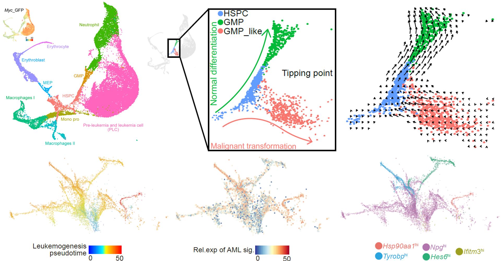

# ***Super RNA splicing entropy drives stepwise leukemogenesis***

Leukemogenesis is proposed to be a multi-step process for normal hematopoietic stem and progenitor cells to be transformed into full-blown leukemic cells, the details of which have not been fully understood. Here, we performed serial single-cell transcriptome analyses of pre-leukemic and leukemic cells (PLCs) and constructed the cellular and molecular transforming trajectories in a murine AML model. We found that the tipping point for HSPCs to generate the initiating PLCs was characterized by dramatically increased splicing factors and paradoxically high levels of unspliced transcripts, which led to high levels of mature mRNAs of multiple leukemia-associated genes. PLCs acquired explosive heterogeneity at the end stage, partially through RNA alternative splicing. Among them, an exon skipping of *Tmem134* gave rise to a subpopulation with increased proliferation and associated with poor prognosis. Thus, we propose that super RNA splicing entropy, indicated by simultaneous high levels of splicing factor expressions and unspliced transcripts, permits PLCs to choose tumor-promoting gene isoforms and thus gradually acquire malignancy. 

To Increase analyzing reproducibility of our data, we had submitted all scripts and processed data for sharing the landscape of leukemogenesis and academic principles we proposed in our paper. We have submitted all processed data on [GEO Database GSE142645](https://www.ncbi.nlm.nih.gov/geo/query/acc.cgi?acc=GSE142645) and you could download them under following agreements. We also store our codes and figures in Markdown files that everyone could regarded them as tutorials for beginner of Omics analysis. 

In this project, to better analyze and visualize our data, we have modified a lot of function formulas from perfect packages. And we had shared them to help others improve their work efficiency in omics data analysis and visualizations.

# **Markdown files recording codes of analyzing and visualization**

## Codes of Single cell RNA-seq analysis

[scRNA_analysis](scRNA_analysis.md) is the code for visualizations in leukemogenesis landscape mentioned in our paper. And you could access this code by click [here](scRNA_analysis.md).

## Codes of survival analysis

[Survival_analysis ](Survival_analysis.md) is the code for analysis in correlation between Genes and/or gene signatrues and survival information. And you could access this code by click [here](Survival_analysis.md).

## Analysis of TMEM134 in AML patients

[TMEM134_analysis ](TMEM134_analysis.md) is the code for mining the potential correlation of TMEM134 in AML patients. And you could access this code by click [here](TMEM134_analysis.md).

## Codes of unspliced detected in pre-AML

[Unspliced_analysis ](Unspliced_analysis.md) is the code for detecting and quantifying the unspliced counts in pre-AML data and patinets' data from bulk RNA-seq.  And you could access this code by click [here](Unspliced_analysis.md).

# **Citation**

Our paper has been published on XXXXX

You could downloaded raw data from [GEO Database GSE142645](https://www.ncbi.nlm.nih.gov/geo/query/acc.cgi?acc=GSE142645)

