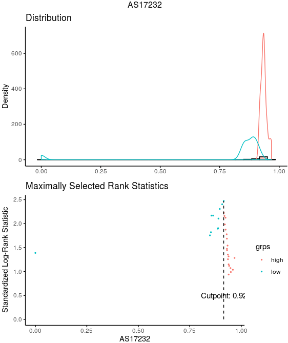
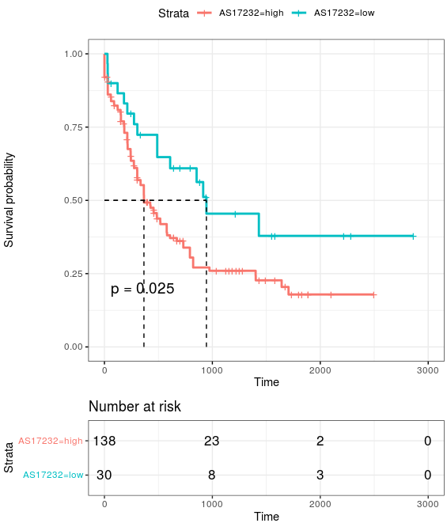

# TMEM134 analysis

## 1. AS events in TCGA-LAML

~~~R
LAML_AS2_mouse <- read.csv(file="./AML_PROJECT/TCGA_AML/1_human_LAML_with_ourmouse_splicing.csv")
TMEM134_AS <- subset(LAML_AS2_mouse,symbol.x=="TMEM134" & splice_type.x=="ES")
TMEM134_AS <- subset(TMEM134_AS,as_id=="17231" | as_id=="17232")
rownames(TMEM134_AS) <- TMEM134_AS$as_id
TMEM134_AS_PSI <- TMEM134_AS[,21:ncol(TMEM134_AS)]
TMEM134_AS_PSI <- as.data.frame(t(TMEM134_AS_PSI))
colnames(TMEM134_AS_PSI) <- paste0("AS",colnames(TMEM134_AS_PSI))
TMEM134_AS_PSI$AS17231 <- as.character(TMEM134_AS_PSI$AS17231)
TMEM134_AS_PSI$AS17232 <- as.character(TMEM134_AS_PSI$AS17232)
TMEM134_AS_PSI[is.na(TMEM134_AS_PSI)] <- 0
TMEM134_AS_PSI$AS17231[which(TMEM134_AS_PSI$AS17231=="null")] <- 0
TMEM134_AS_PSI$AS17232[which(TMEM134_AS_PSI$AS17232=="null")] <- 0
#TMEM134_AS_PSI <- TMEM134_AS_PSI[-which(TMEM134_AS_PSI$AS17231=="null"),]
TMEM134_AS_PSI$AS17231 <- as.numeric(as.character(TMEM134_AS_PSI$AS17231))
TMEM134_AS_PSI$AS17232 <- as.numeric(as.character(TMEM134_AS_PSI$AS17232))
TMEM134_AS_PSI$group <- ifelse(TMEM134_AS_PSI$AS17232 >= median(TMEM134_AS_PSI$AS17232), paste0("AS17232",' High'),paste0("AS17232",' Low'))

TCGA_LAML_clinical <- read.csv("./ALL_TCGA_DATA/clinical_info/ALL_info_includ_RNA_DNA/TCGA/TCGA-LAML_clinical.csv")
TCGA_LAML_clinical <- TCGA_LAML_clinical[,c("gender","X","submitter_id","primary_diagnosis","site_of_resection_or_biopsy","age_at_diagnosis","days_to_death","vital_status","tumor_stage","days_to_last_follow_up")]
TCGA_LAML_clinical$submitter_id <- gsub("-","_",TCGA_LAML_clinical$submitter_id)
rownames(TCGA_LAML_clinical) <- TCGA_LAML_clinical$submitter_id
#TCGA_LAML_clinical <- subset(TCGA_LAML_clinical,gender=="male")
both_id <- intersect(rownames(TMEM134_AS_PSI),rownames(TCGA_LAML_clinical))
TCGA_LAML_clinical <- TCGA_LAML_clinical[both_id,]
TMEM134_AS_PSI <- TMEM134_AS_PSI[both_id,]

library("survival")
library("survminer")
TCGA_LAML_clinical_sel <- TCGA_LAML_clinical[rownames(TMEM134_AS_PSI),]
Escc_clinical_ <- cbind(TCGA_LAML_clinical_sel,TMEM134_AS_PSI)
meta <- Escc_clinical_
meta$days_to_last_follow_up[is.na(meta$days_to_last_follow_up)] <- "HHH"
tmp <- subset(meta,days_to_last_follow_up=="HHH")
tmp$days_to_last_follow_up <- tmp$days_to_death
no_na <- meta[setdiff(rownames(meta),rownames(tmp)),]
all_merge <- rbind(tmp,no_na)
all_merge <- subset(all_merge,days_to_last_follow_up != "HHH")
all_merge$vital_status <- as.character(all_merge$vital_status)
all_merge$status <- ifelse(all_merge$vital_status=="Alive",0,1)
all_merge$days_to_last_follow_up <- as.numeric(all_merge$days_to_last_follow_up)
fit <- survfit(Surv(days_to_last_follow_up, status) ~ group, data = all_merge)
ggsurvplot(fit, data = all_merge,
surv.median.line = "hv",
pval = TRUE,
ggtheme = theme_bw(),
risk.table=TRUE)
all_merge.cut <- surv_cutpoint(
   all_merge,
   time = "days_to_last_follow_up",
   event = "status",
   variables = c("AS17232"),
   progressbar=TRUE,
   minprop=0.1
)
summary(all_merge.cut)
plot(all_merge.cut, "AS17232")
all_merge.cut.cat <- surv_categorize(all_merge.cut) 
library(survival)
fit <- survfit(Surv(days_to_last_follow_up, status) ~ AS17232, data = all_merge.cut.cat)
aa <- ggsurvplot(fit, data = all_merge.cut.cat,
surv.median.line = "hv",
pval = TRUE,
ggtheme = theme_bw(),
risk.table=TRUE)
ggsave("./new_figure_v2/new_figure/TCGA_LAML_TMEM134_AS_survival.svg", plot=aa$plot,width = 6, height = 5,dpi=1080)
~~~

