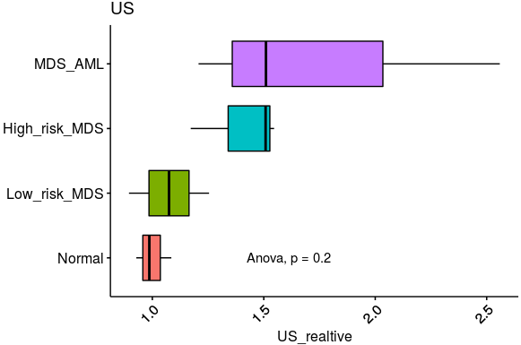
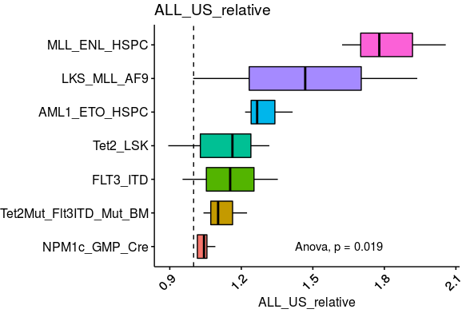

# Unspliced counts analysis

## 1. Unsplcied detected in pre-AML

~~~shell
~~~

## 2. Unsplcied analysis in pre-AML

~~~R
suppressPackageStartupMessages({
  library(dplyr)
  library(Seurat)
  library(Matrix)
  library(proxy)
  library(gplots)
  library(Rtsne)
  library(densityClust)
  library(irlba)
  library(monocle)
  library(plyr)
  library(DOSE)
  library(clusterProfiler)
  library(topGO)
  library(pathview)
  library(AnnotationDbi)
  library(cowplot)
  library(ggplot2)
  library(velocyto.R)
  library(trqwe)
  library(Rsamtools)
  library(GenomicFeatures)
  library(GenomicAlignments)
  library(BiocParallel)
  library(pheatmap)
  library(RColorBrewer)
  library(PoiClaClu)
  library(org.Mm.eg.db)
  library(org.Hs.eg.db)
  library(DESeq2)
  library(data.table)
  library(stringr)
  library(iTALK)
  library(nichenetr)
  library(tidyr)
})
source("/mnt/data/user_data/xiangyu/programme/R_PACKAGES/my_code/MyBestFunction_scRNA.R")
source("/mnt/data/user_data/xiangyu/programme/R_PACKAGES/my_code/Pseudo_CNV_series.R")
library(future)
library(future.apply)
options(future.globals.maxSize = 300 * 1024^3)
plan("multiprocess", workers = 15)
plan()
library(scales)
library(BuenColors)

MDS_AML_nmat <- mcreadRDS("/mnt/data/user_data/xiangyu/workshop/RNAseq/AML_ALL_BAM/velocyto_result/MDS_AML_HUMAN_nmat.rds", mc.cores=20)
remid_names <- rownames(MDS_AML_nmat)[which(apply(MDS_AML_nmat,1,sum)!=0)]
MDS_AML_nmat <- MDS_AML_nmat[remid_names,]
MDS_AML_nmat <- MDS_AML_nmat[,c("Normal1","Normal2","Normal3","Low_risk_MDS1","Low_risk_MDS2")]
samples <- data.frame(group=c(rep("Normal",3),rep("Low_risk_MDS",2)),
  samplename=colnames(MDS_AML_nmat),
  new_group=c(rep("Normal",3),rep("Low_risk_MDS",2)),
  row.names=colnames(MDS_AML_nmat))
Low_risk_MDS <- MDS_AML_nmat[,colnames(MDS_AML_nmat) %in% subset(samples,group=="Low_risk_MDS")$samplename]
Normal <- MDS_AML_nmat[,colnames(MDS_AML_nmat) %in% subset(samples,group=="Normal")$samplename]
Low_risk_MDS <- data.frame(US_Score=future_apply(Low_risk_MDS,2,mean),sample=colnames(Low_risk_MDS))
Normal <- data.frame(US_Score=future_apply(Normal,2,mean),sample=colnames(Normal))
Low_risk_MDS_vs_Normal <- rbind(Low_risk_MDS,Normal)
Low_risk_MDS_vs_Normal$group <- samples[rownames(Low_risk_MDS_vs_Normal),]$group
Low_risk_MDS_vs_Normal$group <- factor(Low_risk_MDS_vs_Normal$group,levels=c("Normal","Low_risk_MDS"))

MDS_AML_nmat <- mcreadRDS("/mnt/data/user_data/xiangyu/workshop/RNAseq/AML_ALL_BAM/velocyto_result/MDS_AML_HUMAN_nmat.rds", mc.cores=20)
remid_names <- rownames(MDS_AML_nmat)[which(apply(MDS_AML_nmat,1,sum)!=0)]
MDS_AML_nmat <- MDS_AML_nmat[remid_names,]
MDS_AML_nmat <- MDS_AML_nmat[,c("High_risk_MDS1","High_risk_MDS2","High_risk_MDS3","Low_risk_MDS1","Low_risk_MDS2")]
samples <- data.frame(group=c(rep("High_risk_MDS",3),rep("Low_risk_MDS",2)),
  samplename=colnames(MDS_AML_nmat),
  new_group=c(rep("High_risk_MDS",3),rep("Low_risk_MDS",2)),
  row.names=colnames(MDS_AML_nmat))
High_risk_MDS <- MDS_AML_nmat[,colnames(MDS_AML_nmat) %in% subset(samples,group=="High_risk_MDS")$samplename]
Low_risk_MDS <- MDS_AML_nmat[,colnames(MDS_AML_nmat) %in% subset(samples,group=="Low_risk_MDS")$samplename]
High_risk_MDS <- data.frame(US_Score=future_apply(High_risk_MDS,2,mean),sample=colnames(High_risk_MDS))
Low_risk_MDS <- data.frame(US_Score=future_apply(Low_risk_MDS,2,mean),sample=colnames(Low_risk_MDS))
High_risk_MDS_vs_Low_risk_MDS <- rbind(High_risk_MDS,Low_risk_MDS)
High_risk_MDS_vs_Low_risk_MDS$group <- samples[rownames(High_risk_MDS_vs_Low_risk_MDS),]$group
High_risk_MDS_vs_Low_risk_MDS$group <- factor(High_risk_MDS_vs_Low_risk_MDS$group,levels=c("Low_risk_MDS","High_risk_MDS"))

MDS_AML_nmat <- mcreadRDS("/mnt/data/user_data/xiangyu/workshop/RNAseq/AML_ALL_BAM/velocyto_result/MDS_AML_HUMAN_nmat.rds", mc.cores=20)
remid_names <- rownames(MDS_AML_nmat)[which(apply(MDS_AML_nmat,1,sum)!=0)]
MDS_AML_nmat <- MDS_AML_nmat[remid_names,]
MDS_AML_nmat <- MDS_AML_nmat[,c("High_risk_MDS1","High_risk_MDS2","High_risk_MDS3","MDS_AML1","MDS_AML2","MDS_AML3")]
samples <- data.frame(group=c(rep("High_risk_MDS",3),rep("MDS_AML",3)),
  samplename=colnames(MDS_AML_nmat),
  new_group=c(rep("High_risk_MDS",3),rep("MDS_AML",3)),
  row.names=colnames(MDS_AML_nmat))
High_risk_MDS <- MDS_AML_nmat[,colnames(MDS_AML_nmat) %in% subset(samples,group=="High_risk_MDS")$samplename]
MDS_AML <- MDS_AML_nmat[,colnames(MDS_AML_nmat) %in% subset(samples,group=="MDS_AML")$samplename]
High_risk_MDS <- data.frame(US_Score=future_apply(High_risk_MDS,2,mean),sample=colnames(High_risk_MDS))
MDS_AML <- data.frame(US_Score=future_apply(MDS_AML,2,mean),sample=colnames(MDS_AML))
High_risk_MDS_vs_MDS_AML <- rbind(High_risk_MDS,MDS_AML)
High_risk_MDS_vs_MDS_AML$group <- samples[rownames(High_risk_MDS_vs_MDS_AML),]$group
High_risk_MDS_vs_MDS_AML$group <- factor(High_risk_MDS_vs_MDS_AML$group,levels=c("High_risk_MDS","MDS_AML"))

AML_MLL_AF9_nmat <- mcreadRDS("/mnt/data/user_data/xiangyu/workshop/RNAseq/AML_ALL_BAM/velocyto_result/NCBI_AML_MLL_AF9_and_Ctrl_nmat.rds", mc.cores=20)
remid_names <- rownames(AML_MLL_AF9_nmat)[which(apply(AML_MLL_AF9_nmat,1,sum)!=0)]
AML_MLL_AF9_nmat <- AML_MLL_AF9_nmat[remid_names,]
AML_MLL_AF9_nmat <- AML_MLL_AF9_nmat[,c("LKS_Ctrl_1","LKS_Ctrl_2","LKS_MLL_AF9_1","LKS_MLL_AF9_2")]
samples <- data.frame(group=c(rep("LKS_Ctrl",2),rep("LKS_MLL_AF9",2)),
  samplename=colnames(AML_MLL_AF9_nmat),
  new_group=c(rep("LKS_Ctrl",2),rep("LKS_MLL_AF9",2)),
  row.names=colnames(AML_MLL_AF9_nmat))
LKS_Ctrl <- AML_MLL_AF9_nmat[,colnames(AML_MLL_AF9_nmat) %in% subset(samples,group=="LKS_Ctrl")$samplename]
LKS_MLL_AF9 <- AML_MLL_AF9_nmat[,colnames(AML_MLL_AF9_nmat) %in% subset(samples,group=="LKS_MLL_AF9")$samplename]
LKS_Ctrl <- data.frame(US_Score=future_apply(LKS_Ctrl,2,mean),sample=colnames(LKS_Ctrl))
LKS_MLL_AF9 <- data.frame(US_Score=future_apply(LKS_MLL_AF9,2,mean),sample=colnames(LKS_MLL_AF9))
LKS_Ctrl_vs_LKS_MLL_AF9 <- rbind(LKS_Ctrl,LKS_MLL_AF9)
LKS_Ctrl_vs_LKS_MLL_AF9$group <- samples[rownames(LKS_Ctrl_vs_LKS_MLL_AF9),]$group
LKS_Ctrl_vs_LKS_MLL_AF9$group <- factor(LKS_Ctrl_vs_LKS_MLL_AF9$group,levels=c("LKS_Ctrl","LKS_MLL_AF9"))

AML_FLT3_ITD_nmat <- mcreadRDS("/mnt/data/user_data/xiangyu/workshop/RNAseq/AML_ALL_BAM/velocyto_result/NCBI_AML_FLT3_ITD_and_Ctrl_nmat.rds", mc.cores=20)
remid_names <- rownames(AML_FLT3_ITD_nmat)[which(apply(AML_FLT3_ITD_nmat,1,sum)!=0)]
AML_FLT3_ITD_nmat <- AML_FLT3_ITD_nmat[remid_names,]
AML_FLT3_ITD_nmat <- AML_FLT3_ITD_nmat[,c("CreERT1","CreERT2","FLT3_ITD1","FLT3_ITD2")]
samples <- data.frame(group=c(rep("CreERT",2),rep("FLT3_ITD",2)),
  samplename=colnames(AML_FLT3_ITD_nmat),
  new_group=c(rep("CreERT",2),rep("FLT3_ITD",2)),
  row.names=colnames(AML_FLT3_ITD_nmat))
CreERT <- AML_FLT3_ITD_nmat[,colnames(AML_FLT3_ITD_nmat) %in% subset(samples,group=="CreERT")$samplename]
FLT3_ITD <- AML_FLT3_ITD_nmat[,colnames(AML_FLT3_ITD_nmat) %in% subset(samples,group=="FLT3_ITD")$samplename]
CreERT <- data.frame(US_Score=future_apply(CreERT,2,mean),sample=colnames(CreERT))
FLT3_ITD <- data.frame(US_Score=future_apply(FLT3_ITD,2,mean),sample=colnames(FLT3_ITD))
CreERT_vs_FLT3_ITD <- rbind(CreERT,FLT3_ITD)
CreERT_vs_FLT3_ITD$group <- samples[rownames(CreERT_vs_FLT3_ITD),]$group
CreERT_vs_FLT3_ITD$group <- factor(CreERT_vs_FLT3_ITD$group,levels=c("CreERT","FLT3_ITD"))

AML1_ETO_nmat <- mcreadRDS("/mnt/data/user_data/xiangyu/workshop/RNAseq/AML_ALL_BAM/velocyto_result/AML1_ETO_nmat.rds", mc.cores=20)
remid_names <- rownames(AML1_ETO_nmat)[which(apply(AML1_ETO_nmat,1,sum)!=0)]
AML1_ETO_nmat <- AML1_ETO_nmat[remid_names,]
AML1_ETO_nmat <- AML1_ETO_nmat[,c("WT_HSPC_1","WT_HSPC_2","WT_HSPC_3","AML1_ETO_HSPC_1",
  "AML1_ETO_HSPC_2","AML1_ETO_HSPC_3")]
samples <- data.frame(group=c(rep("WT_HSPC",3),rep("AML1_ETO_HSPC",3)),
  samplename=colnames(AML1_ETO_nmat),
  new_group=c(rep("WT_HSPC",3),rep("AML1_ETO_HSPC",3)),
  row.names=colnames(AML1_ETO_nmat))
WT_HSPC <- AML1_ETO_nmat[,colnames(AML1_ETO_nmat) %in% subset(samples,group=="WT_HSPC")$samplename]
AML1_ETO_HSPC <- AML1_ETO_nmat[,colnames(AML1_ETO_nmat) %in% subset(samples,group=="AML1_ETO_HSPC")$samplename]
WT_HSPC <- data.frame(US_Score=future_apply(WT_HSPC,2,mean),sample=colnames(WT_HSPC))
AML1_ETO_HSPC <- data.frame(US_Score=future_apply(AML1_ETO_HSPC,2,mean),sample=colnames(AML1_ETO_HSPC))
WT_HSPC_vs_AML1_ETO_HSPC <- rbind(WT_HSPC,AML1_ETO_HSPC)
WT_HSPC_vs_AML1_ETO_HSPC$group <- samples[rownames(WT_HSPC_vs_AML1_ETO_HSPC),]$group
WT_HSPC_vs_AML1_ETO_HSPC$group <- factor(WT_HSPC_vs_AML1_ETO_HSPC$group,levels=c("WT_HSPC","AML1_ETO_HSPC"))

MLL_ENL_nmat <- mcreadRDS("/mnt/data/user_data/xiangyu/workshop/RNAseq/AML_ALL_BAM/velocyto_result/MLL_ENL_2_Mut_nmat.rds", mc.cores=20)
remid_names <- rownames(MLL_ENL_nmat)[which(apply(MLL_ENL_nmat,1,sum)!=0)]
MLL_ENL_nmat <- MLL_ENL_nmat[remid_names,]
MLL_ENL_nmat <- MLL_ENL_nmat[,c("WT_HSPC_1","WT_HSPC_2","WT_HSPC_3","MLL_ENL_HSPC_1",
  "MLL_ENL_HSPC_2","MLL_ENL_HSPC_3")]
samples <- data.frame(group=c(rep("WT_HSPC",3),rep("MLL_ENL_HSPC",3)),
  samplename=colnames(MLL_ENL_nmat),
  new_group=c(rep("WT_HSPC",3),rep("MLL_ENL_HSPC",3)),
  row.names=colnames(MLL_ENL_nmat))
WT_HSPC <- MLL_ENL_nmat[,colnames(MLL_ENL_nmat) %in% subset(samples,group=="WT_HSPC")$samplename]
MLL_ENL_HSPC <- MLL_ENL_nmat[,colnames(MLL_ENL_nmat) %in% subset(samples,group=="MLL_ENL_HSPC")$samplename]
WT_HSPC <- data.frame(US_Score=future_apply(WT_HSPC,2,mean),sample=colnames(WT_HSPC))
MLL_ENL_HSPC <- data.frame(US_Score=future_apply(MLL_ENL_HSPC,2,mean),sample=colnames(MLL_ENL_HSPC))
WT_HSPC_vs_MLL_ENL_HSPC <- rbind(WT_HSPC,MLL_ENL_HSPC)
WT_HSPC_vs_MLL_ENL_HSPC$group <- samples[rownames(WT_HSPC_vs_MLL_ENL_HSPC),]$group
WT_HSPC_vs_MLL_ENL_HSPC$group <- factor(WT_HSPC_vs_MLL_ENL_HSPC$group,levels=c("WT_HSPC","MLL_ENL_HSPC"))

Tet2Mut_Flt3ITD_Mut_nmat <- mcreadRDS("/mnt/data/user_data/xiangyu/workshop/RNAseq/AML_ALL_BAM/velocyto_result/Tet2Mut_Flt3ITD_Mut_nmat.rds", mc.cores=20)
remid_names <- rownames(Tet2Mut_Flt3ITD_Mut_nmat)[which(apply(Tet2Mut_Flt3ITD_Mut_nmat,1,sum)!=0)]
Tet2Mut_Flt3ITD_Mut_nmat <- Tet2Mut_Flt3ITD_Mut_nmat[remid_names,]
Tet2Mut_Flt3ITD_Mut_nmat <- Tet2Mut_Flt3ITD_Mut_nmat[,c("WT_BM_1","WT_BM_2","WT_BM_3","Tet2Mut_Flt3ITD_Mut_BM_1",
  "Tet2Mut_Flt3ITD_Mut_BM_2","Tet2Mut_Flt3ITD_Mut_BM_3")]
samples <- data.frame(group=c(rep("WT_BM",3),rep("Tet2Mut_Flt3ITD_Mut_BM",3)),
  samplename=colnames(Tet2Mut_Flt3ITD_Mut_nmat),
  new_group=c(rep("WT_BM",3),rep("Tet2Mut_Flt3ITD_Mut_BM",3)),
  row.names=colnames(Tet2Mut_Flt3ITD_Mut_nmat))
WT_BM <- Tet2Mut_Flt3ITD_Mut_nmat[,colnames(Tet2Mut_Flt3ITD_Mut_nmat) %in% subset(samples,group=="WT_BM")$samplename]
Tet2Mut_Flt3ITD_Mut_BM <- Tet2Mut_Flt3ITD_Mut_nmat[,colnames(Tet2Mut_Flt3ITD_Mut_nmat) %in% subset(samples,group=="Tet2Mut_Flt3ITD_Mut_BM")$samplename]
WT_BM <- data.frame(US_Score=future_apply(WT_BM,2,mean),sample=colnames(WT_BM))
Tet2Mut_Flt3ITD_Mut_BM <- data.frame(US_Score=future_apply(Tet2Mut_Flt3ITD_Mut_BM,2,mean),sample=colnames(Tet2Mut_Flt3ITD_Mut_BM))
WT_BM_vs_Tet2Mut_Flt3ITD_Mut_BM <- rbind(WT_BM,Tet2Mut_Flt3ITD_Mut_BM)
WT_BM_vs_Tet2Mut_Flt3ITD_Mut_BM$group <- samples[rownames(WT_BM_vs_Tet2Mut_Flt3ITD_Mut_BM),]$group
WT_BM_vs_Tet2Mut_Flt3ITD_Mut_BM$group <- factor(WT_BM_vs_Tet2Mut_Flt3ITD_Mut_BM$group,levels=c("WT_BM","Tet2Mut_Flt3ITD_Mut_BM"))

Nras_and_Tet2_Mut_nmat <- mcreadRDS("/mnt/data/user_data/xiangyu/workshop/RNAseq/AML_ALL_BAM/velocyto_result/Nras_and_Tet2_Mut_nmat.rds", mc.cores=20)
remid_names <- rownames(Nras_and_Tet2_Mut_nmat)[which(apply(Nras_and_Tet2_Mut_nmat,1,sum)!=0)]
Nras_and_Tet2_Mut_nmat <- Nras_and_Tet2_Mut_nmat[remid_names,]
Nras_and_Tet2_Mut_nmat <- Nras_and_Tet2_Mut_nmat[,c("WT_LSK_1","WT_LSK_2","WT_LSK_3","Tet2_LSK_1",
  "Tet2_LSK_2","Tet2_LSK_3")]
samples <- data.frame(group=c(rep("WT_LSK",3),rep("Tet2_LSK",3)),
  samplename=colnames(Nras_and_Tet2_Mut_nmat),
  new_group=c(rep("WT_LSK",3),rep("Tet2_LSK",3)),
  row.names=colnames(Nras_and_Tet2_Mut_nmat))
WT_LSK <- Nras_and_Tet2_Mut_nmat[,colnames(Nras_and_Tet2_Mut_nmat) %in% subset(samples,group=="WT_LSK")$samplename]
Tet2_LSK <- Nras_and_Tet2_Mut_nmat[,colnames(Nras_and_Tet2_Mut_nmat) %in% subset(samples,group=="Tet2_LSK")$samplename]
WT_LSK <- data.frame(US_Score=future_apply(WT_LSK,2,mean),sample=colnames(WT_LSK))
Tet2_LSK <- data.frame(US_Score=future_apply(Tet2_LSK,2,mean),sample=colnames(Tet2_LSK))
WT_LSK_vs_Tet2_LSK <- rbind(WT_LSK,Tet2_LSK)
WT_LSK_vs_Tet2_LSK$group <- samples[rownames(WT_LSK_vs_Tet2_LSK),]$group
WT_LSK_vs_Tet2_LSK$group <- factor(WT_LSK_vs_Tet2_LSK$group,levels=c("WT_LSK","Tet2_LSK"))

NPM1C_DNMT3A_KNOCKIN <- mcreadRDS("/mnt/data/user_data/xiangyu/workshop/RNAseq/AML_ALL_BAM/velocyto_result/NPM1C_DNMT3A_KNOCKIN_nmat.rds", mc.cores=20)
remid_names <- rownames(NPM1C_DNMT3A_KNOCKIN)[which(apply(NPM1C_DNMT3A_KNOCKIN,1,sum)!=0)]
NPM1C_DNMT3A_KNOCKIN <- NPM1C_DNMT3A_KNOCKIN[remid_names,]
NPM1C_DNMT3A_KNOCKIN <- NPM1C_DNMT3A_KNOCKIN[,c("WT_GMP_Cre_1","WT_GMP_Cre_2","WT_GMP_Cre_3","NPM1c_GMP_Cre_1",
  "NPM1c_GMP_Cre_2","NPM1c_GMP_Cre_3","NPM1c_GMP_Cre_4")]
samples <- data.frame(group=c(rep("WT_GMP_Cre",3),rep("NPM1c_GMP_Cre",4)),
  samplename=colnames(NPM1C_DNMT3A_KNOCKIN),
  new_group=c(rep("WT_GMP_Cre",3),rep("NPM1c_GMP_Cre",4)),
  row.names=colnames(NPM1C_DNMT3A_KNOCKIN))
WT_GMP_Cre <- NPM1C_DNMT3A_KNOCKIN[,colnames(NPM1C_DNMT3A_KNOCKIN) %in% subset(samples,group=="WT_GMP_Cre")$samplename]
NPM1c_GMP_Cre <- NPM1C_DNMT3A_KNOCKIN[,colnames(NPM1C_DNMT3A_KNOCKIN) %in% subset(samples,group=="NPM1c_GMP_Cre")$samplename]
WT_GMP_Cre <- data.frame(US_Score=future_apply(WT_GMP_Cre,2,mean),sample=colnames(WT_GMP_Cre))
NPM1c_GMP_Cre <- data.frame(US_Score=future_apply(NPM1c_GMP_Cre,2,mean),sample=colnames(NPM1c_GMP_Cre))
WT_GMP_Cre_vs_NPM1c_GMP_Cre <- rbind(WT_GMP_Cre,NPM1c_GMP_Cre)
WT_GMP_Cre_vs_NPM1c_GMP_Cre$group <- samples[rownames(WT_GMP_Cre_vs_NPM1c_GMP_Cre),]$group
WT_GMP_Cre_vs_NPM1c_GMP_Cre$group <- factor(WT_GMP_Cre_vs_NPM1c_GMP_Cre$group,levels=c("WT_GMP_Cre","NPM1c_GMP_Cre"))

High_risk_MDS_vs_Low_risk_MDStmp <- High_risk_MDS_vs_Low_risk_MDS
High_risk_MDS_vs_MDS_AMLtmp <- High_risk_MDS_vs_MDS_AML
Low_risk_MDS_vs_Normaltmp <- Low_risk_MDS_vs_Normal
ALL_MERGR <- rbind(High_risk_MDS_vs_MDS_AMLtmp[c(4:6),],High_risk_MDS_vs_Low_risk_MDStmp)
ALL_MERGR <- rbind(ALL_MERGR,Low_risk_MDS_vs_Normaltmp[c(3:5),])
ALL_MERGR$US_realtive <- ALL_MERGR$US_Score/mean(subset(ALL_MERGR,group=="Normal")$US_Score)
ALL_MERGR$group <- factor(ALL_MERGR$group,levels=c("Normal","Low_risk_MDS","High_risk_MDS","MDS_AML"))
write.csv(ALL_MERGR,"/mnt/data/user_data/xiangyu/workshop/scRNA/AML_MYC/v1_Figure/low_high_MDS_AML_US_summary.csv")
library(ggpubr)
p <- ggboxplot(ALL_MERGR, x = "group", y = "US_realtive", fill = "group", orientation = "horizontal",
    title="US", legend = "none",outlier.shape = NA,ylim=c(min(ALL_MERGR$US_realtive)-0.5,max(ALL_MERGR$US_realtive)+0.5)) +
    rotate_x_text(angle = 45)+stat_compare_means(method = "anova", label.y = 1.5)
ggsave("/mnt/data/user_data/xiangyu/workshop/scRNA/AML_MYC/v1_Figure/MDS_AML_US_summery.svg", plot=p,width = 4, height = 4,dpi=1080)
~~~

~~~R
all_data <- list(LKS_Ctrl_vs_LKS_MLL_AF9,CreERT_vs_FLT3_ITD, WT_HSPC_vs_AML1_ETO_HSPC, WT_HSPC_vs_MLL_ENL_HSPC, 
  WT_BM_vs_Tet2Mut_Flt3ITD_Mut_BM,  WT_LSK_vs_Tet2_LSK, WT_GMP_Cre_vs_NPM1c_GMP_Cre)
all_data_ <- future_lapply(1:length(all_data),function(x){
  tmp <- all_data[[x]]
  ALL_US_tmp <- all_data[[x]]
  tmp$ALL_US <- ALL_US_tmp[rownames(tmp),]$US_Score
  tmp$ALL_US_relative <- tmp$ALL_US/mean(subset(tmp,group==levels(tmp$group)[1])$ALL_US)
  tmp_ <- subset(tmp,group==levels(tmp$group)[2])
  tmp_$SRS_meidan <- median(tmp_$SRS_relative)
  tmp_$ALL_US_meidan <- median(tmp_$ALL_US_relative)
  message(unique(tmp_$group)," is done")
  return(tmp_)
  })
sum_all <- do.call(rbind,all_data_)

sum_all_ <- sum_all[!duplicated(sum_all$group),]
sum_all_ <- sum_all_[order(sum_all_$ALL_US_meidan,decreasing=TRUE),]
sum_all$group <- factor(sum_all$group, levels=as.character(sum_all_$group)[length(as.character(sum_all_$group)):1])
library(ggpubr)
p1 <- ggboxplot(sum_all, x = "group", y = "ALL_US_relative", fill = "group", orientation = "horizontal",
      title="ALL_US_relative", legend = "none",outlier.shape = NA,ylim=c(min(sum_all$ALL_US_relative)-0.5,
        max(sum_all$ALL_US_relative)+0.5)) +
      rotate_x_text(angle = 45)+geom_hline(yintercept = 1, linetype = 2)+
      stat_compare_means(method = "anova", label.y = 1.5)
ggsave("/mnt/data/user_data/xiangyu/workshop/scRNA/AML_MYC/v1_Figure/ALL_US_summery.svg", plot=p1,width = 4, height = 6,dpi=1080)
~~~

~~~R
all_data1_ <- future_lapply(1:length(all_data),function(x){
  tmp <- all_data[[x]]
  ALL_US_tmp <- all_data[[x]]
  tmp$ALL_US <- ALL_US_tmp[rownames(tmp),]$US_Score
  tmp$ALL_US_relative <- tmp$ALL_US/mean(subset(tmp,group==levels(tmp$group)[1])$ALL_US)
  message(unique(tmp$group)," is done")
  return(tmp)
  })
all_data1 <- do.call(rbind,all_data1_)
write.csv(all_data1,"/mnt/data/user_data/xiangyu/workshop/scRNA/AML_MYC/v1_Figure/pre_AML_US_summary.csv")
~~~

