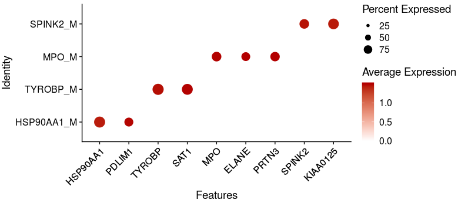

# scRNA landscape visualization of leukemogenesis

## 1. The visualization of murine leukemogenesis

~~~R
scRNA_leukemogenesis_all <- mcreadRDS("/mnt/data/GEO_SUBMIT/scAML_project/sc-RNAseq/mmu_10X_scRNA_Landscape_of_leukemogenesis_all.rds",mc.cores=20)
scRNA_leukemogenesis_all$new_anno3 <- factor(scRNA_leukemogenesis_all$new_anno3,levels=c("HSPC","GMP","Mono pro","Neutrophil",
  "Macrophages I","Macrophages II","MEP","Erythroblast","Erythrocytes","GMP like","Neutrophil like"))
scRNA_leukemogenesis_all$new_anno4 <- as.character(scRNA_leukemogenesis_all$new_anno3)
scRNA_leukemogenesis_all$new_anno4[which(scRNA_leukemogenesis_all$new_anno4=="GMP like")] <- "PLC"
scRNA_leukemogenesis_all$new_anno4[which(scRNA_leukemogenesis_all$new_anno4=="Neutrophil like")] <- "PLC"
Idents(scRNA_leukemogenesis_all) <- scRNA_leukemogenesis_all$new_anno4
scRNA_leukemogenesis_all$new_anno4 <- factor(scRNA_leukemogenesis_all$new_anno4,levels=c("HSPC","GMP","Mono pro","Neutrophil",
  "Macrophages I","Macrophages II","MEP","Erythroblast","Erythrocytes","PLC"))
tipping_point <- mcreadRDS(file="/mnt/data/GEO_SUBMIT/scAML_project/sc-RNAseq/mmu_10X_scRNA_Landscape_of_leukemogenesis_tipping_point.rds", mc.cores=20)
scRNA_leukemogenesis_all$new_anno5 <- as.character(scRNA_leukemogenesis_all$new_anno4)
scRNA_leukemogenesis_all$new_anno5[rownames(tipping_point@meta.data)] <- tipping_point$new_anno4
scRNA_leukemogenesis_all$new_anno5[which(scRNA_leukemogenesis_all$new_anno5=="GMP like")] <- "PLC"
scRNA_leukemogenesis_all$new_anno5[which(scRNA_leukemogenesis_all$new_anno5=="Neutrophil like")] <- "PLC"
scRNA_leukemogenesis_all$new_anno5 <- factor(scRNA_leukemogenesis_all$new_anno5,levels=c("HSPC","GMP","Mono pro","Neutrophil",
  "Macrophages I","Macrophages II","MEP","Erythroblast","Erythrocytes","PLC"))
p1 <- DimPlot(object = scRNA_leukemogenesis_all,reduction = "umap",pt.size=.1, label = FALSE, repel = FALSE,group.by="new_anno5") +NoAxes()
ggsave("/mnt/data/user_data/xiangyu/workshop/scRNA/AML_MYC/drop_seq/SPLIT/new_figure_v2/new_figure/ALL_interested_umap.png", plot=p1,width = 6, height = 5,dpi=1080)
p1 <- DimPlot(object = scRNA_leukemogenesis_all,reduction = "umap",pt.size=.1, label = FALSE, repel = FALSE,split.by="new_group",group.by="new_anno5") +NoAxes()
ggsave("/mnt/data/user_data/xiangyu/workshop/scRNA/AML_MYC/drop_seq/SPLIT/new_figure_v2/new_figure/ALL_interested_umap_by_group.png", plot=p1,width = 20, height = 5,dpi=1080)
~~~

~~~R
scRNA_leukemogenesis_all$new_group2 <- gsub("HSPC","Normal",scRNA_leukemogenesis_all$group)
scRNA_leukemogenesis_all$new_group2 <- gsub("Too","Normal",scRNA_leukemogenesis_all$new_group2)
aa <- as.data.frame(table(scRNA_leukemogenesis_all$new_group2,scRNA_leukemogenesis_all$new_anno5))
aa_all <- c()
for (i in unique(aa$Var1)){
  group_sel <- subset(aa,Var1==i)
  group_sel$sum_number <- sum(group_sel$Freq)
  aa_all <- rbind(aa_all,group_sel)
}
all_group_normalised<- c()
for (i in unique(aa_all$Var1)){
  tmp_group <- subset(aa_all,Var1==i)
  tmp_group$cluster_all <- (tmp_group$Freq/tmp_group$sum_number)
  tmp_group$normal_ratio <- (tmp_group$cluster_all/sum(tmp_group$cluster_all))*100
  tmp_group$normal_ratio <- round(tmp_group$normal_ratio,2)
  all_group_normalised <- rbind(all_group_normalised,tmp_group)
}
all_group_normalised <- subset(all_group_normalised,Freq != 0)
all_group_normalised$new_group <- gsub("Normal","Normal",all_group_normalised$Var1)
all_group_normalised$new_group <- gsub("T1_L","T1",all_group_normalised$new_group)
all_group_normalised$new_group <- gsub("T1_R","T1",all_group_normalised$new_group)
all_group_normalised$new_group <- gsub("T2_2R","T2",all_group_normalised$new_group)
all_group_normalised$new_group <- gsub("T2_N","T2",all_group_normalised$new_group)
all_group_normalised$new_group <- gsub("Tend_1L","T3",all_group_normalised$new_group)
all_group_normalised$new_group <- gsub("Tend_2L","T3",all_group_normalised$new_group)
require(pheatmap)
require(ComplexHeatmap)
require(BuenColors)
require(scales) 
col_sel <- hue_pal()(length(as.character(levels(scRNA_leukemogenesis_all$new_anno5))))
col <- col_sel[1:length(as.character(levels(scRNA_leukemogenesis_all$new_anno5)))]
names(col) <- as.character(levels(scRNA_leukemogenesis_all$new_anno5))
library(ggpubr)
library("ggsci")
library("ggplot2")
library("gridExtra")
p <- list()
for (i in 1:length(unique(all_group_normalised$Var2))){
    sle_clu <- as.character(unique(all_group_normalised$Var2))[i]
    sel_normali <- subset(all_group_normalised,Var2==sle_clu)
    p[[i]] <- ggline(sel_normali, add = c("mean_se", "jitter"),x="new_group", y="normal_ratio",color=col[sle_clu],title=sle_clu)
    message(sle_clu," is done")
}
aa <- plot_grid(p[[1]],p[[2]],p[[3]],p[[4]],p[[5]],p[[6]],p[[7]],p[[8]],p[[9]],p[[10]],ncol=6)
ggsave("/mnt/data/user_data/xiangyu/workshop/scRNA/AML_MYC/v1_Figure/supplemental_ALL_ratio_alter.svg", plot=aa,width = 18, height = 3,dpi=1080)
~~~

~~~R
Idents(scRNA_leukemogenesis_all) <- scRNA_leukemogenesis_all$new_anno5   
scRNA_leukemogenesis_all_markers <- FindAllMarkers(object = scRNA_leukemogenesis_all, only.pos = T, min.pct = 0.25,thresh.use = 0.25)
write.csv(scRNA_leukemogenesis_all_markers,"/mnt/data/user_data/xiangyu/workshop/scRNA/NSCLC_PD1/v2/v2_results/scRNA_leukemogenesis_all_markers.csv")

AML_markers <- read.csv("/mnt/data/user_data/xiangyu/workshop/scRNA/NSCLC_PD1/v2/v2_results/scRNA_leukemogenesis_all_markers.csv")
table(AML_markers$cluster)
AML_markers_filter <- subset(AML_markers,p_val_adj < 0.05)
table(AML_markers_filter$cluster)
top50_ <- future_lapply(levels(AML_markers_filter$cluster),function(x) {
  tmp <- subset(AML_markers_filter,cluster==x)
  tmp <- tmp[order(tmp$avg_logFC,decreasing=TRUE),]
  return(tmp[1:50,])
  })
top50 <- do.call(rbind,top50_)
sel_genes <- top50$gene
sel_genes <- intersect(sel_genes,rownames(scRNA_leukemogenesis_all))
all_marker <- c("Ifitm1","Cd34","Fcnb","Cd63","Ctsg","Mpo","Elane","Retnlg","Mmp8","Ifitm6","S100a9","Ly6g","Cd74","Ly6e","H2-Ab1","H2-Aa","Kit","Gata1","Car2","Mt2","Car1","Gypa","Hbb-bs","Hba-a1","Hbb-bt","GFP","Orm1","Phgdh")
scRNA_leukemogenesis_all$new_anno5 <- factor(scRNA_leukemogenesis_all$new_anno5,levels=c("HSPC","GMP","Mono pro","Neutrophil",
  "Macrophages I","Macrophages II","MEP","Erythroblast","Erythrocytes","PLC"))
pdf(file="/mnt/data/user_data/xuelan/project/3_singlecell/1_myc_wubaohong/20200224_new/10_20210526_figure/4_all_marker_gene_heatmaps.pdf",width =12, height =8)
XY_heatmap(seurat_obj=scRNA_leukemogenesis_all,group="new_anno5",genes=sel_genes,all_num=FALSE,new_names=NULL,labels_rot=90,
  assay_sel="RNA",color=colorRampPalette(brewer.pal(10, "RdBu"))(101),min_and_max_cut=2,show_row_names=FALSE,mark_gene=all_marker,label_size=0,scale=TRUE)
dev.off()
~~~

## 2. The visualization of PLC cells

~~~R
PLC_10X_scRNA <- mcreadRDS(file="/mnt/data/GEO_SUBMIT/scAML_project/sc-RNAseq/mmu_10X_scRNA_Landscape_of_leukemogenesis_PLC.rds", mc.cores=20)
require(pheatmap)
require(ComplexHeatmap)
require(BuenColors)
require(scales) 
New_T00_obj.markers <- readRDS(file="/mnt/data/user_data/xiangyu/workshop/scRNA/AML_MYC/figure/Fig_New_T00_obj.markers.rds")
y <- New_T00_obj.markers$p_val_adj
filter_New_T00_obj.markers <- New_T00_obj.markers[with(New_T00_obj.markers,y<=0.05),]
y <- filter_New_T00_obj.markers$cluster
HSPC_MARKER_ALL <- filter_New_T00_obj.markers[with(filter_New_T00_obj.markers,y=="HSPC"),]
Mono_pro_MARKER_ALL <- filter_New_T00_obj.markers[with(filter_New_T00_obj.markers,y=="Mono_pro"),]
Neutro_MARKER_ALL <- filter_New_T00_obj.markers[with(filter_New_T00_obj.markers,y=="Neutro"),]
GMP_MARKER_ALL <- filter_New_T00_obj.markers[with(filter_New_T00_obj.markers,y=="GMP"),]
HSPC_MARKER_ALL <- filter_New_T00_obj.markers[with(filter_New_T00_obj.markers,y=="HSPC"),]
HSPC_MARKER_ALL_sel <- subset(HSPC_MARKER_ALL,avg_logFC > 0.6)
DefaultAssay(object = PLC_10X_scRNA) <- "RNA"
MLL3_SC <- PLC_10X_scRNA
Lineage_marker <- HSPC_MARKER_ALL$gene
    tmp <- MLL3_SC
    Lineage_marker <- intersect(rownames(GetAssayData(object = tmp, slot = "data")),Lineage_marker)
    speci_raw <- FetchData(object = tmp, vars = Lineage_marker,slot="data")
PLC_10X_scRNA[["HSPC_MARKER_ALL"]] <- (rowSums(speci_raw))/length(Lineage_marker)
MLL3_SC <- PLC_10X_scRNA
Lineage_marker <- Neutro_MARKER_ALL$gene
    tmp <- MLL3_SC
    Lineage_marker <- intersect(rownames(GetAssayData(object = tmp, slot = "data")),Lineage_marker)
    speci_raw <- FetchData(object = tmp, vars = Lineage_marker,slot="data")
PLC_10X_scRNA[["Neutro_MARKER_ALL"]] <- (rowSums(speci_raw))/length(Lineage_marker)
Myc_targets <- read.csv(file="/mnt/data/user_data/xiangyu/workshop/scRNA/NSCLC_PD1/v2/v2_results/MYC_TARGETS.csv")
Myc_targets <- na.omit(Myc_targets)
AML_UP_gene <- Myc_targets$mmu_Genes
Lineage_marker <- AML_UP_gene
    tmp <- PLC_10X_scRNA
    Lineage_marker <- intersect(rownames(GetAssayData(object = tmp, slot = "data")),AML_UP_gene)
    speci_raw <- FetchData(object = tmp, vars = Lineage_marker,slot="data")
PLC_10X_scRNA[["Myc_targets"]] <- (rowSums(speci_raw))/length(Lineage_marker)
~~~

~~~R
library(BuenColors)
aa <- jdb_palette("brewer_celsius")
show_col(aa)
GFP_P_Malig_Trans_filter_data <- FetchData(object = GFP_P_Malig_Trans_filter, vars = c("HSPC_MARKER_ALL","Neutro_MARKER_ALL","new_group"))
GFP_P_Malig_Trans_filter_data$HSPC_MARKER_ALL <- (GFP_P_Malig_Trans_filter_data$HSPC_MARKER_ALL-mean(GFP_P_Malig_Trans_filter_data$HSPC_MARKER_ALL))/(max(GFP_P_Malig_Trans_filter_data$HSPC_MARKER_ALL)-min(GFP_P_Malig_Trans_filter_data$HSPC_MARKER_ALL))
GFP_P_Malig_Trans_filter_data$Neutro_MARKER_ALL <- (GFP_P_Malig_Trans_filter_data$Neutro_MARKER_ALL-mean(GFP_P_Malig_Trans_filter_data$Neutro_MARKER_ALL))/(max(GFP_P_Malig_Trans_filter_data$Neutro_MARKER_ALL)-min(GFP_P_Malig_Trans_filter_data$Neutro_MARKER_ALL))
sp <- ggplot(GFP_P_Malig_Trans_filter_data, aes(x=Neutro_MARKER_ALL, y=HSPC_MARKER_ALL)) +
  geom_point(colour="#bdc3c7",alpha=0.1)
sp + stat_density_2d(aes(fill = ..level..), geom="polygon")+theme_classic()+
    scale_fill_gradientn(colours=alpha(aa,0.6),na.value="NA") + facet_wrap(~new_group,ncol=4) + labs(title="ALL only netro lineages in GFP P cells")
sp1 <- sp + stat_density_2d(aes(fill = ..level..), geom="polygon")+theme_classic()+
    scale_fill_gradientn(colours=alpha(aa,0.6),limits = c(1.1,45),na.value="NA") + facet_wrap(~new_group,ncol=4) + labs(title="ALL only netro lineages in GFP P cells")
ggsave("/mnt/data/user_data/xiangyu/workshop/scRNA/AML_MYC/drop_seq/SPLIT/new_figure_v2/new_figure/Stemnessand_difff_score.svg", plot=sp1,width = 15, height = 4,dpi=1080)
~~~

~~~R
cc.genes <- readRDS("/mnt/data/user_data/xiangyu/workshop/DATABASE/mouse_cell_cycle_genes.rds")
s.genes <- cc.genes$s.genes
g2m.genes <- cc.genes$g2m.genes
g2m.genes_list <- intersect(g2m.genes,rownames(PLC_10X_scRNA))
s.genes_list <- intersect(s.genes,rownames(PLC_10X_scRNA))
PLC_10X_scRNA <- CellCycleScoring(object = PLC_10X_scRNA,g2m.features =g2m.genes, s.features = s.genes,set.ident = TRUE,nbin=2)
cc.genes <- readRDS("/mnt/data/user_data/xiangyu/workshop/DATABASE/mouse_cell_cycle_genes.rds")
s.genes <- cc.genes$s.genes
g2m.genes <- cc.genes$g2m.genes
MLL3_SC <- PLC_10X_scRNA
Lineage_marker <- g2m.genes
    tmp <- MLL3_SC
    Lineage_marker <- intersect(rownames(GetAssayData(object = tmp, slot = "data")),Lineage_marker)
    speci_raw <- FetchData(object = tmp, vars = Lineage_marker,slot="data")
PLC_10X_scRNA[["G2M_Score"]] <- (rowSums(speci_raw))/length(Lineage_marker)
MLL3_SC <- PLC_10X_scRNA
Lineage_marker <- s.genes
    tmp <- MLL3_SC
    Lineage_marker <- intersect(rownames(GetAssayData(object = tmp, slot = "data")),Lineage_marker)
    speci_raw <- FetchData(object = tmp, vars = Lineage_marker,slot="data")
PLC_10X_scRNA[["S_Score"]] <- (rowSums(speci_raw))/length(Lineage_marker)
meta_info <- PLC_10X_scRNA@meta.data
meta_info$G2M_Score <- scale(meta_info$G2M_Score)
meta_info$S_Score <- scale(meta_info$S_Score)
meta_info$G2M.Score <- scale(meta_info$G2M.Score)
meta_info$S.Score <- scale(meta_info$S.Score)
meta_info$XL_ann
library(BuenColors)
aa <- jdb_palette("brewer_celsius")
sp <- ggplot(meta_info, aes(x=G2M_Score, y=S_Score)) +
  geom_point(colour="#bdc3c7",alpha=0.1)
sp1 <- sp + stat_density_2d(aes(fill = ..level..), geom="polygon")+theme_classic() +xlim(-2.5,2.5)+ylim(-3,3)+
    scale_fill_gradientn(colours=alpha(aa,0.6),na.value="NA") + facet_wrap(~new_group,ncol=4) + labs(title="ALL only netro lineages in GFP P cells")
ggsave("/mnt/data/user_data/xiangyu/workshop/scRNA/AML_MYC/drop_seq/SPLIT/new_figure_v2/new_figure/cell_cycle_score.svg", plot=sp1,width = 15, height = 4,dpi=1080)
~~~

~~~R
Myc_targets <- read.csv(file="/mnt/data/user_data/xiangyu/workshop/scRNA/NSCLC_PD1/v2/v2_results/MYC_TARGETS.csv")
Myc_targets$entrez <- mapIds(x = org.Mm.eg.db,
                      keys = as.character(Myc_targets$mmu_Genes),
          keytype ="SYMBOL",
          column ="ENTREZID",
          multiVals="first")
Myc_targets1 <- XY_subset(Myc_targets,"mmu_Genes",intersect(Myc_targets$mmu_Genes,rownames(PLC_10X_scRNA)))
KEGGupres <- enrichKEGG(gene =as.character(Myc_targets$entrez), 
        organism = 'mouse', 
        keyType = "ncbi-geneid",
         pvalueCutoff = 0.05,
             pAdjustMethod = "BH", 
             minGSSize = 10, 
             maxGSSize = 500,
             qvalueCutoff = 0.2, 
             use_internal_data = TRUE)
aa <- dotplot(KEGGupres,showCategory=10) + 
  theme(axis.text.x  = element_text(angle=45, vjust=1,size=8,hjust = 1)) + labs(title = "enrichKEGG")
ggsave("/mnt/data/user_data/xiangyu/workshop/scRNA/AML_MYC/drop_seq/SPLIT/new_figure_v2/new_figure/MYC_TARGETS_PLC_KEGG.svg", plot=aa,width = 5, height = 3,dpi=1080)
~~~

~~~R
splicing_gene <- read.csv(file="/mnt/data/user_data/xiangyu/8922_server/workshop/scseq/SCLC/splicing_factor.csv")
SFs <- as.character(splicing_gene$splicing_factor)
MLL3_SC <- PLC_10X_scRNA
Lineage_marker <- SFs
    tmp <- MLL3_SC
    Lineage_marker <- intersect(rownames(GetAssayData(object = tmp, slot = "data")),Lineage_marker)
    speci_raw <- FetchData(object = tmp, vars = Lineage_marker,slot="data")
PLC_10X_scRNA[["SFs"]] <- (rowSums(speci_raw))/length(Lineage_marker)
sel_data <- FetchData(object = PLC_10X_scRNA, vars = c("SFs","new_group"),slot="data")
sel_data$new_group <- factor(sel_data$new_group,levels=c("T0","T1","T2","T3"))
library(ggpubr)
p1 <- ggboxplot(sel_data, x = "new_group", y = "SFs", fill = "new_group",
  title=paste0("SFs"), legend = "none",outlier.shape = NA) + 
  rotate_x_text(angle = 45)+
 stat_compare_means(comparisons =list(c("T0","T1"),c("T0","T2"),c("T0","T3"), c("T1","T2"), c("T1","T3"), c("T2","T3")),label = "p.signif", method = "t.test")
~~~

## 3. The visualization of tipping point during leukemogenesis

~~~R
tipping_point <- mcreadRDS(file="/mnt/data/GEO_SUBMIT/scAML_project/sc-RNAseq/mmu_10X_scRNA_Landscape_of_leukemogenesis_tipping_point.rds", mc.cores=20)
DimPlot(object = tipping_point,reduction = "umap",pt.size=2, label = TRUE, repel = TRUE,group.by="new_anno4")
~~~

~~~R
Pesudo_FeaturePlot(object = tipping_point, features = c("HSPC_GMP_like_DIff","HSPC_only_GMP_DIff"),ncol=2,pt.size=.5,reduction="umap",label=T,cols = CustomPalette(low ="#007BBF", mid = "#FFF485",high = "#FF0000")) +NoAxes()
~~~

~~~R
nmat <- mcreadRDS("/mnt/data/GEO_SUBMIT/scAML_project/sc-RNAseq/mmu_10X_scRNA_Landscape_of_leukemogenesis_all_unspliced.rds", mc.cores=20)
nmat_only_tip <- nmat[,colnames(tipping_point)]
only_tip_seuratnmat <- CreateSeuratObject(counts = nmat_only_tip,assay = 'RNA',project = 'RNA',min.cells = 0,meta.data = tipping_point@meta.data[,c("new_anno4","new_group")])
only_tip_seuratnmat <- NormalizeData(only_tip_seuratnmat)
Idents(only_tip_seuratnmat) <- only_tip_seuratnmat$new_anno4
only_tip_seuratnmat.markers <- FindMarkers(object = only_tip_seuratnmat, ident.1="GMP like",ident.2="GMP",only.pos = FALSE, min.pct = 0,thresh.use = 0)
only_tip_seuratnmat.markers_DGEs <- subset(only_tip_seuratnmat.markers,p_val_adj < 0.05 & abs(avg_logFC)>0)
table(only_tip_seuratnmat.markers_DGEs$avg_logFC>0)
only_tip_seuratnmat.markers_DGEs$cluster <- ifelse(only_tip_seuratnmat.markers_DGEs$avg_logFC>0,"GMP_like","GMP")
only_tip_seuratnmat.markers_DGEs$gene <- rownames(only_tip_seuratnmat.markers_DGEs)
write.csv(only_tip_seuratnmat.markers_DGEs,"/mnt/data/user_data/xiangyu/workshop/scRNA/NSCLC_PD1/v2/v2_results/only_tip_seuratnmat.markers_DGEs.csv")

library(org.Mm.eg.db)
info <- only_tip_seuratnmat.markers_DGEs[,c("cluster","gene")]
info$cluster <- as.character(info$cluster) 
top_marker <- c()
number.group <- length(unique(info$cluster))
for (i in c(1:number.group)){
  y <- info$cluster
  marker <- info[with(info,y==unique(info$cluster)[i]),]
  top_marker[[i]] <- marker
  names(top_marker)[i] <- unique(info$cluster)[i]
}
gcSampl <- c()
for (i in c(1:length(top_marker))){
t <- top_marker[[i]]
symbol <- as.character(t$gene)
DD <- symbol
t$entrez <- mapIds(x = org.Mm.eg.db,
                        keys = DD,
            keytype ="SYMBOL",
            column ="ENTREZID",
            multiVals="first")
names <- na.omit(t)
entrez <- as.character(names$entrez)
gcSampl[[i]] <- entrez
names(gcSampl)[i] <- names(top_marker)[i]
print(paste(names(top_marker)[i],"is done",sep = " "))
}
HLH_T1_OFF_HIGH_KEGG <- compareCluster(geneCluster = gcSampl, fun = "enrichKEGG",organism="mmu",
    use_internal_data=TRUE, minGSSize = 5)
HLH_T1_OFF_HIGH_GO <- compareCluster(geneCluster = gcSampl, fun = "enrichGO",OrgDb="org.Mm.eg.db",keyType = "ENTREZID", ont = "BP",readable = TRUE,
    minGSSize = 5)
mcsaveRDS(HLH_T1_OFF_HIGH_GO,file="/mnt/data/user_data/xiangyu/workshop/scRNA/AML_MYC/drop_seq/SPLIT/new_seurat/only_tip_GO_BP_nmat.rds",mc.cores=20) 
HLH_T1_OFF_HIGH_GO <- mcreadRDS(file="/mnt/data/user_data/xiangyu/workshop/scRNA/AML_MYC/drop_seq/SPLIT/new_seurat/only_tip_GO_BP_nmat.rds",mc.cores=20) 
write.csv(HLH_T1_OFF_HIGH_GO,"/mnt/data/user_data/xiangyu/workshop/scRNA/NSCLC_PD1/v2/v2_results/only_tip_GO_BP_nmat.csv")
SE_all_clu1 <- as.data.frame(HLH_T1_OFF_HIGH_GO)
SE_all_clu1 <- SE_all_clu1[order(SE_all_clu1$Cluster,(SE_all_clu1$p.adjust)),]
SE_all_clu1[grep("splic",SE_all_clu1$Description,value=FALSE),]
sel_path <- c(c(subset(SE_all_clu1,Cluster=="GMP_like")$Description[c(1,2)],"RNA splicing","regulation of RNA splicing","mRNA splicing, via spliceosome"),
  c(subset(SE_all_clu1,Cluster=="GMP")$Description[1:5]),
  subset(SE_all_clu1,Cluster=="clu_3")$Description[1:5],
  subset(SE_all_clu1,Cluster=="clu_4")$Description[c(1,5,9,12,17)])
SE_all_clu1 <- XY_subset(SE_all_clu1,"Description",sel_path)
SE_all_clu1 <- SE_all_clu1[order(SE_all_clu1$Cluster,(SE_all_clu1$p.adjust)),]
SE_all_clu1$ID <- paste0(SE_all_clu1$ID,1:nrow(SE_all_clu1))
rownames(SE_all_clu1) <- SE_all_clu1$ID
geneSets <- as(SE_all_clu1[, "ID"], "list")
names(geneSets) <- SE_all_clu1[, "ID"]
rownames(SE_all_clu1) <- SE_all_clu1$ID
data_sel <- new("compareClusterResult", compareClusterResult = SE_all_clu1, geneClusters = gcSampl,fun = "enrichKEGG")
aa <- dotplot(data_sel,showCategory=5,includeAll=FALSE) + 
  theme(axis.text.x  = element_text(angle=45, vjust=1,size=8,hjust = 1)) + labs(title = "GO BP")
ggsave("/mnt/data/user_data/xiangyu/workshop/scRNA/SCLC/metastasisi/merge_all/Figure_making/US_tippingpoint_GO_BP.svg", plot=aa,width = 6, height = 5,dpi=1080)
~~~

## 4. The visualization of murine PLC  during leukemogenesis by forced-directed graph

~~~R
Malignant_all <- mcreadRDS(file="/mnt/data/GEO_SUBMIT/scAML_project/sc-RNAseq/mmu_10X_scRNA_Landscape_of_Malignant_all.rds",mc.cores=20)
all_data <- read.csv("/mnt/data/user_data/xiangyu/workshop/scRNA/AML_MYC/drop_seq/SPLIT/new_figure_v2/MDS_AML_ALL.markers.csv")
GAL_LEUKEMIC_STEM_CELL_UP <- read.csv(file="/mnt/data/user_data/xiangyu/workshop/scRNA/AML_MYC/GAL_LEUKEMIC_STEM_CELL_UP.csv")
MLL3_SC <- Malignant_all
Lineage_marker <- subset(all_data,group=="AML_UP_signature")$genes
    tmp <- MLL3_SC
    Lineage_marker <- intersect(rownames(GetAssayData(object = tmp, slot = "data")),Lineage_marker)
    speci_raw <- FetchData(object = tmp, vars = Lineage_marker,slot="data")
Malignant_all[["AML_UP_gene"]] <- (rowSums(speci_raw))/length(Lineage_marker)
MLL3_SC <- Malignant_all
Lineage_marker <- unique(GAL_LEUKEMIC_STEM_CELL_UP$MGI.symbol)
    tmp <- MLL3_SC
    Lineage_marker <- intersect(rownames(GetAssayData(object = tmp, slot = "data")),Lineage_marker)
    speci_raw <- FetchData(object = tmp, vars = Lineage_marker,slot="data")
Malignant_all[["LSC"]] <- (rowSums(speci_raw))/length(Lineage_marker)
library(URD)
axial.tree_fixed <- mcreadRDS("/mnt/data/GEO_SUBMIT/scAML_project/sc-RNAseq/mmu_10X_scRNA_Landscape_of_Malignant_urd_fixed.rds",mc.cores=20)
axial.tree_fixed@meta$LSC <- Malignant_all@meta.data[rownames(axial.tree_fixed@meta),]$LSC
axial.tree_fixed@meta$AML_UP_gene <- Malignant_all@meta.data[rownames(axial.tree_fixed@meta),]$AML_UP_gene
axial.tree_fixed@meta$AML_UP_gene1 <- Malignant_all@meta.data[rownames(axial.tree_fixed@meta),]$AML_UP_gene
table(axial.tree_fixed@meta$AML_UP_gene1>0.102)
axial.tree_fixed@meta$AML_UP_gene1[which(axial.tree_fixed@meta$AML_UP_gene1>0.102)] <- 0.102
table(axial.tree_fixed@meta$AML_UP_gene1<0.015)
axial.tree_fixed@meta$AML_UP_gene1[which(axial.tree_fixed@meta$AML_UP_gene1<0.015)] <- 0.015
plotTreeForce(axial.tree_fixed, "AML_UP_gene1", alpha=0.2, view="figure1",label.tips=FALSE,alpha.fade=1,size = 10,
    cells.show=rownames(axial.tree_fixed@meta)[which(axial.tree_fixed@meta$AML_UP_gene>0.016)],
    colors=jdb_palette("brewer_celsius",type = c("continuous"))[1:length(jdb_palette("brewer_celsius",type = c("continuous")))])
~~~

~~~R
plotTreeForce(axial.tree_fixed, "pseudotime", alpha=0.2, view="figure1",label.tips=FALSE)
~~~

~~~R
plotTreeForce(axial.tree_fixed, "new_anno4", alpha=0.2, view="figure1",label.tips=FALSE)
~~~

~~~R
axial.tree_fixed@meta$new_group2 <- axial.tree_fixed@meta$new_group
axial.tree_fixed@meta$new_group2[which(axial.tree_fixed@meta$new_group2!="T0")] <- "Others"
stage.colors <- c("#e5e2e2","#FF80E7")
plotTreeForce(axial.tree_fixed, "new_group2", alpha=0.2, view="figure1",label.tips=FALSE, discrete.colors = stage.colors)
~~~

~~~R
axial.tree_fixed@meta$new_group2 <- axial.tree_fixed@meta$new_group
axial.tree_fixed@meta$new_group2[which(axial.tree_fixed@meta$new_group2!="T1")] <- "Others"
stage.colors <- c("#e5e2e2","#00DAE0")
plotTreeForce(axial.tree_fixed, "new_group2", alpha=0.2, view="figure1",label.tips=FALSE, discrete.colors = stage.colors)
~~~

~~~R
axial.tree_fixed@meta$new_group2 <- axial.tree_fixed@meta$new_group
axial.tree_fixed@meta$new_group2[which(axial.tree_fixed@meta$new_group2!="T2")] <- "Others"
stage.colors <- c("#e5e2e2","#00D983")
plotTreeForce(axial.tree_fixed, "new_group2", alpha=0.2, view="figure1",label.tips=FALSE, discrete.colors = stage.colors)
~~~

~~~R
axial.tree_fixed@meta$new_group2 <- axial.tree_fixed@meta$new_group
axial.tree_fixed@meta$new_group2[which(axial.tree_fixed@meta$new_group2!="T3")] <- "Others"
stage.colors <- c("#e5e2e2","#EAB000")
plotTreeForce(axial.tree_fixed, "new_group2", alpha=0.2, view="figure1",label.tips=FALSE, discrete.colors = stage.colors)
~~~

## 5. The visualization of murine PLC  at T3

~~~r
Malignant3_only_inT3 <- mcreadRDS(file="/mnt/data/GEO_SUBMIT/scAML_project/sc-RNAseq/mmu_10X_scRNA_Landscape_of_leukemogenesis_Malignant_at_T3.rds")
Malignant3_only_inT3$new_anno5 <- as.character(Malignant3_only_inT3$RNA_snn_res.0.1)
Malignant3_only_inT3$new_anno5[which(Malignant3_only_inT3$RNA_snn_res.0.1=="0")] <- "Npg Malig"
Malignant3_only_inT3$new_anno5[which(Malignant3_only_inT3$RNA_snn_res.0.1=="1")] <- "Ifitm3 Malig"
Malignant3_only_inT3$new_anno5[which(Malignant3_only_inT3$RNA_snn_res.0.1=="2")] <- "Tyrobp Malig"
Malignant3_only_inT3$new_anno5[which(Malignant3_only_inT3$RNA_snn_res.0.1=="3")] <- "Hes6 Malig"
Malignant3_only_inT3$new_anno5[which(Malignant3_only_inT3$RNA_snn_res.0.1=="4")] <- "Hsp90aa1 Malig"
Malignant3_only_inT3$new_anno5 <- factor(Malignant3_only_inT3$new_anno5,levels=c("Hsp90aa1 Malig","Ifitm3 Malig","Hes6 Malig","Tyrobp Malig","Npg Malig"))
DimPlot(object = Malignant3_only_inT3, reduction = "umap",label=T,group.by="new_anno5")
~~~

~~~R
Malignant3_only_inT3$new_anno5 <- factor(Malignant3_only_inT3$new_anno5,levels=c("Hsp90aa1 Malig","Tyrobp Malig","Npg Malig","Hes6 Malig","Ifitm3 Malig"))
Idents(Malignant3_only_inT3) <- Malignant3_only_inT3$new_anno5
Malignant3_only_inT3.markers <- FindAllMarkers(object = Malignant3_only_inT3, only.pos = TRUE, min.pct = 0.05,logfc.threshold = 0.05)
write.csv(Malignant3_only_inT3.markers,"/mnt/data/user_data/xiangyu/workshop/scRNA/NSCLC_PD1/v2/v2_results/Malignant3_only_inT3.markers.csv")

Malignant3_only_inT3$new_anno5 <- factor(Malignant3_only_inT3$new_anno5,levels=c("Hsp90aa1 Malig","Tyrobp Malig","Npg Malig","Hes6 Malig","Ifitm3 Malig"))
Malignant3_only_inT3_genes <- c("Hsp90aa1","Pdlim1","Cyc1","Hspe1","Tmem14c","Tyrobp","Sat1","Srgn","Nfkbia","Fos","Ngp","Orm1","Ltf","Camp","Lcn2","Ly6c2","Hes6","Map4k1","mt-Atp6","mt-Cytb","Ifitm3","Ifitm1","Thbs1","Fabp5","Retnlg")
Malignant3_only_inT3_genes <- c("Hsp90aa1","Pdlim1","Cyc1","Tmem14c","Tyrobp","Sat1","Nfkbia","Ngp","Ltf","Lcn2","Ly6c2","Hes6","mt-Cytb","Ifitm3","Ifitm1","Thbs1")
p1 <- DotPlot(Malignant3_only_inT3, features = Malignant3_only_inT3_genes,group.by="new_anno5", cols=c("#ffffff", "#B30000"),scale = TRUE,col.min = 0,col.max = 5) + RotatedAxis()
ggsave("/mnt/data/user_data/xuelan/project/3_singlecell/1_myc_wubaohong/20200224_new/10_20210526_figure/2_mouse_5tumor_genemarker_dotplot.svg", plot=p1,width = 8.5, height = 5,dpi=1080)
~~~

~~~R
TCGA_LAML <- read.csv("/mnt/data/user_data/xiangyu/workshop/DATABASE/ALL_TCGA_DATA/RNA/FPKM/TCGA/TCGA-LAML_RNA_expr.csv")
rownames(TCGA_LAML) <- TCGA_LAML$X
TCGA_LAML <- TCGA_LAML[,-1]
library(org.Hs.eg.db)
library(AnnotationDbi)
anno_data=org.Hs.eg.db
TCGA_LAML$symbol <- mapIds(x = anno_data,
                        keys = rownames(TCGA_LAML),
            keytype ="ENSEMBL",
            column ="SYMBOL",
            multiVals="first")
TCGA_LAML <- na.omit(TCGA_LAML)
TCGA_LAML <- TCGA_LAML[!duplicated(TCGA_LAML$symbol),]
rownames(TCGA_LAML) <- TCGA_LAML$symbol
TCGA_LAML <- TCGA_LAML[,-ncol(TCGA_LAML)]
colnames(TCGA_LAML) <- substring(colnames(TCGA_LAML),1,12)
TCGA_LAML <- as.data.frame(t(TCGA_LAML))
TCGA_LAML1 <- log(TCGA_LAML+1,2)
#TCGA_LAML1 <- as.data.frame(t(TCGA_LAML1))
TCGA_LAML1 <- TCGA_LAML1[apply(TCGA_LAML1,1,sd)!=0,]

TCGA_LAML_clinical <- read.csv("/mnt/data/user_data/xiangyu/workshop/DATABASE/ALL_TCGA_DATA/clinical_info/ALL_info_includ_RNA_DNA/TCGA/TCGA-LAML_clinical.csv")
TCGA_LAML_clinical <- TCGA_LAML_clinical[,c("gender","X","submitter_id","primary_diagnosis","site_of_resection_or_biopsy","age_at_diagnosis","days_to_death","vital_status","tumor_stage","days_to_last_follow_up")]
TCGA_LAML_clinical$submitter_id <- gsub("-",".",TCGA_LAML_clinical$submitter_id)
rownames(TCGA_LAML_clinical) <- TCGA_LAML_clinical$submitter_id
#TCGA_LAML_clinical <- subset(TCGA_LAML_clinical,gender=="male")
both_id <- intersect(rownames(TCGA_LAML1),rownames(TCGA_LAML_clinical))
TCGA_LAML_clinical <- TCGA_LAML_clinical[both_id,]
TCGA_LAML1 <- TCGA_LAML1[both_id,]
Malignant3_only_inT3.markers <- read.csv("/mnt/data/user_data/xiangyu/workshop/scRNA/NSCLC_PD1/v2/v2_results/Malignant3_only_inT3.markers.csv")
clu_Ifitm3 <- subset(Malignant3_only_inT3.markers,cluster=="Ifitm3 Malig")
clu_Tyrobp <- subset(Malignant3_only_inT3.markers,cluster=="Tyrobp Malig")
clu_Npg <- subset(Malignant3_only_inT3.markers,cluster=="Npg Malig")
clu_Hes6 <- subset(Malignant3_only_inT3.markers,cluster=="Hes6 Malig")
clu_Hsp90aa1 <- subset(Malignant3_only_inT3.markers,cluster=="Hsp90aa1 Malig")
library(iTALK)
library(nichenetr)
library(tidyr)
clu_Ifitm3 = clu_Ifitm3 %>% mutate(from = convert_mouse_to_human_symbols(gene), to = convert_mouse_to_human_symbols(gene)) %>% drop_na()
clu_Tyrobp = clu_Tyrobp %>% mutate(from = convert_mouse_to_human_symbols(gene), to = convert_mouse_to_human_symbols(gene)) %>% drop_na()
clu_Npg = clu_Npg %>% mutate(from = convert_mouse_to_human_symbols(gene), to = convert_mouse_to_human_symbols(gene)) %>% drop_na()
clu_Hes6 = clu_Hes6 %>% mutate(from = convert_mouse_to_human_symbols(gene), to = convert_mouse_to_human_symbols(gene)) %>% drop_na()
clu_Hsp90aa1 = clu_Hsp90aa1 %>% mutate(from = convert_mouse_to_human_symbols(gene), to = convert_mouse_to_human_symbols(gene)) %>% drop_na()
TCGA_LAML_Sel <- data.frame(clu_Ifitm3=as.character(apply(TCGA_LAML1[,intersect(colnames(TCGA_LAML1),unique(clu_Ifitm3$from))],1,mean)),
  clu_Tyrobp=as.character(apply(TCGA_LAML1[,intersect(colnames(TCGA_LAML1),unique(clu_Tyrobp$from))],1,mean)),
  clu_Npg=as.character(apply(TCGA_LAML1[,intersect(colnames(TCGA_LAML1),unique(clu_Npg$from))],1,mean)),
  clu_Hes6=as.character(apply(TCGA_LAML1[,intersect(colnames(TCGA_LAML1),unique(clu_Hes6$from))],1,mean)),
  clu_Hsp90aa1=as.character(apply(TCGA_LAML1[,intersect(colnames(TCGA_LAML1),unique(clu_Hsp90aa1$from))],1,mean)),
  row.names=rownames(TCGA_LAML1))
TCGA_LAML_Sel$clu_Ifitm3 <- as.numeric(as.character(TCGA_LAML_Sel$clu_Ifitm3))
TCGA_LAML_Sel$clu_Tyrobp <- as.numeric(as.character(TCGA_LAML_Sel$clu_Tyrobp))
TCGA_LAML_Sel$clu_Npg <- as.numeric(as.character(TCGA_LAML_Sel$clu_Npg))
TCGA_LAML_Sel$clu_Hes6 <- as.numeric(as.character(TCGA_LAML_Sel$clu_Hes6))
TCGA_LAML_Sel$clu_Hsp90aa1 <- as.numeric(as.character(TCGA_LAML_Sel$clu_Hsp90aa1))
library("survival")
library("survminer")
TCGA_LAML_clinical_sel <- TCGA_LAML_clinical[rownames(TCGA_LAML_Sel),]
Escc_clinical_ <- cbind(TCGA_LAML_clinical_sel,TCGA_LAML_Sel)
meta <- Escc_clinical_
meta[is.na(meta)] <- "HHH"
tmp <- subset(meta,days_to_last_follow_up=="HHH")
tmp$days_to_last_follow_up <- tmp$days_to_death
no_na <- meta[setdiff(rownames(meta),rownames(tmp)),]
all_merge <- rbind(tmp,no_na)
all_merge <- subset(all_merge,days_to_last_follow_up != "HHH")
all_merge$vital_status <- as.character(all_merge$vital_status)
all_merge$status <- ifelse(all_merge$vital_status=="Alive",0,1)
all_merge$days_to_last_follow_up <- as.numeric(all_merge$days_to_last_follow_up)
coxph_result <- coxph(formula = Surv(days_to_last_follow_up, status) ~ clu_Ifitm3 +clu_Tyrobp +clu_Npg +clu_Hes6 +clu_Hsp90aa1, 
  data = all_merge)
summary(coxph_result,data=all_merge)
aa <- ggforest(coxph_result, data =all_merge, 
         main = "Hazard ratio", 
         fontsize = 1.0, 
         refLabel = "1", noDigits = 2)
ggsave("/mnt/data/user_data/xiangyu/workshop/scRNA/AML_MYC/drop_seq/SPLIT/new_figure_v2/new_figure/TCGA_LAML_clu_Hsp90aa1_coxl.svg", plot=aa,width = 6, height = 5,dpi=1080)
~~~

~~~R
all_merge.cut <- surv_cutpoint(
   all_merge,
   time = "days_to_last_follow_up",
   event = "status",
   variables = c("clu_Hsp90aa1"),
   progressbar=TRUE,
   minprop=0.1
)
summary(all_merge.cut)
plot(all_merge.cut, "clu_Hsp90aa1")
all_merge.cut.cat <- surv_categorize(all_merge.cut) 
library(survival)
fit <- survfit(Surv(days_to_last_follow_up, status) ~ clu_Hsp90aa1, data = all_merge.cut.cat)
aa <- ggsurvplot(fit, data = all_merge.cut.cat,
surv.median.line = "hv",
pval = TRUE,
ggtheme = theme_bw(),
risk.table=TRUE)
ggsave("/mnt/data/user_data/xiangyu/workshop/scRNA/AML_MYC/drop_seq/SPLIT/new_figure_v2/new_figure/TCGA_LAML_clu_Hsp90aa1_survival.svg", plot=aa$plot,width = 6, height = 5,dpi=1080)
~~~

~~~R
nmat <- mcreadRDS("/mnt/data/GEO_SUBMIT/scAML_project/sc-RNAseq/mmu_10X_scRNA_Landscape_of_leukemogenesis_all_unspliced.rds", mc.cores=20)
nmat_only_Malignant <- nmat[,colnames(Malignant3_only_inT3)]
only_Malignant_seuratnmat <- CreateSeuratObject(counts = nmat_only_Malignant,assay = 'RNA',project = 'RNA',min.cells = 0,meta.data = Malignant3_only_inT3@meta.data[,c("new_anno5","group")])
Idents(only_Malignant_seuratnmat) <- only_Malignant_seuratnmat$new_anno5
Sel_genes <- c("nCount_RNA","nFeature_RNA")
sel_data <- FetchData(object = only_Malignant_seuratnmat, vars = c(Sel_genes,"new_anno5","new_group"),slot="data")
table(sel_data$new_anno5)
sel_data$new_anno5 <- factor(sel_data$new_anno5,levels=c("Hsp90aa1 Malig","Tyrobp Malig","Npg Malig","Hes6 Malig","Ifitm3 Malig"))
library(ggpubr)
PLOT <- list()
for (i in 1:length(unique(Sel_genes))){
  tmp_data <- sel_data[,c(Sel_genes[i],"new_anno5")]
  colnames(tmp_data) <- c("tmp","new_anno5")
  PLOT[[i]] <- ggboxplot(tmp_data, x = "new_anno5", y = "tmp", fill = "new_anno5",
  title=paste0(Sel_genes[i]," ","US events"), legend = "none",outlier.shape = NA) +
  rotate_x_text(angle = 45)+
 stat_compare_means(comparisons =list(c("Hsp90aa1 Malig","Hes6 Malig"),c("Hsp90aa1 Malig","Npg Malig"),c("Hsp90aa1 Malig","Ifitm3 Malig"), c("Hsp90aa1 Malig","Tyrobp Malig")),label = "p.signif", method = "t.test")
}
plot <- CombinePlots(PLOT,ncol=2)
~~~

~~~R
only_Malignant_seuratnmat$new_anno5 <- factor(only_Malignant_seuratnmat$new_anno5,levels=c("Hsp90aa1 Malig","Tyrobp Malig","Npg Malig","Hes6 Malig","Ifitm3 Malig"))
Idents(only_Malignant_seuratnmat) <- only_Malignant_seuratnmat$new_anno5
nmat_only_T3.markers <- FindAllMarkers(object = only_Malignant_seuratnmat, only.pos = TRUE, min.pct = 0.05,logfc.threshold = 0.05)
write.csv(nmat_only_T3.markers,"/mnt/data/user_data/xiangyu/workshop/scRNA/NSCLC_PD1/v2/v2_results/nmat_only_T3.markers.csv")

nmat_only_T3.markers <- read.csv("/mnt/data/user_data/xiangyu/workshop/scRNA/NSCLC_PD1/v2/v2_results/nmat_only_T3.markers.csv")
table(nmat_only_T3.markers$cluster)
library(org.Mm.eg.db)
info <- nmat_only_T3.markers[,c("cluster","gene")]
info$cluster <- as.character(info$cluster) 
top_marker <- c()
number.group <- length(unique(info$cluster))
for (i in c(1:number.group)){
  y <- info$cluster
  marker <- info[with(info,y==unique(info$cluster)[i]),]
  top_marker[[i]] <- marker
  names(top_marker)[i] <- unique(info$cluster)[i]
}
gcSampl <- c()
for (i in c(1:length(top_marker))){
t <- top_marker[[i]]
symbol <- as.character(t$gene)
DD <- symbol
t$entrez <- mapIds(x = org.Mm.eg.db,
                        keys = DD,
            keytype ="SYMBOL",
            column ="ENTREZID",
            multiVals="first")
names <- na.omit(t)
entrez <- as.character(names$entrez)
gcSampl[[i]] <- entrez
names(gcSampl)[i] <- names(top_marker)[i]
print(paste(names(top_marker)[i],"is done",sep = " "))
}
HLH_T1_OFF_HIGH_KEGG <- compareCluster(geneCluster = gcSampl, fun = "enrichKEGG",organism="mmu",
    use_internal_data=TRUE, minGSSize = 5)
HLH_T1_OFF_HIGH_GO <- compareCluster(geneCluster = gcSampl, fun = "enrichGO",OrgDb="org.Mm.eg.db",keyType = "ENTREZID", ont = "BP",readable = TRUE,
    minGSSize = 5)AS_17232_TMEM134
write.csv(HLH_T1_OFF_HIGH_GO,"/mnt/data/user_data/xiangyu/workshop/scRNA/NSCLC_PD1/v2/v2_results/Malignant3_only_inT3_GO_BP_nmat.csv")

aa <- dotplot(HLH_T1_OFF_HIGH_GO,showCategory=5,includeAll=FALSE) + 
  theme(axis.text.x  = element_text(angle=45, vjust=1,size=8,hjust = 1)) + labs(title = "GO BP US")
ggsave("/mnt/data/user_data/xiangyu/workshop/scRNA/AML_MYC/drop_seq/SPLIT/new_figure_v2/new_figure/Malignant3_only_inT3_GO_BP_nmat_GO_BP.svg", plot=aa,width = 6, height = 5,dpi=1080)
~~~

## 6. The visualization of human AML 

~~~R
sel_colors1 <- hue_pal()(length(as.character(levels(Malignant3_only_inT3$new_anno5))))
names(sel_colors1) <- as.character(levels(Malignant3_only_inT3$new_anno5))
human_AML <- mcreadRDS("/mnt/data/GEO_SUBMIT/scAML_project/sc-RNAseq/hsa_10X_scRNA_Landscape_of_leukemogenesis_all.rds",mc.cores=20)
DimPlot(object = human_AML, reduction = "tsne",label=T,group.by="new_anno")
human_AML$new_anno5 <- as.character(human_AML$new_anno)
human_AML$new_anno5[which(human_AML$new_anno5=="T cell")] <- "OTS"
human_AML$new_anno5[which(human_AML$new_anno5=="Erythrocyte")] <- "OTS"
human_AML$new_anno5[which(human_AML$new_anno5=="B cell")] <- "OTS"
human_AML$new_anno5 <- factor(human_AML$new_anno5,levels=c("HSP90AA1_M", "TYROBP_M", "MPO_M", "SPINK2_M","OTS"))
colors_tmp <- hue_pal()(20)
sel_colors <- c(hue_pal()(2),colors_tmp[length(sel_colors1):(length(sel_colors1)+1)])
names_clu <- c("HSP90AA1_M", "TYROBP_M", "MPO_M", "SPINK2_M")
col <- sel_colors
names(col) <- names_clu
col <- c(col,"#efefef")
names(col)[length(col)] <- "OTS"
p1 <- XY_DimPlot(human_AML, reduction = 'tsne', 
  label = FALSE,repel=TRUE, pt.size = 1,
  group.by="new_anno5",cols=col)
ggsave("/mnt/data/user_data/xiangyu/workshop/scRNA/AML_MYC/drop_seq/SPLIT/new_figure_v2/new_figure/human_AML_tsne_by_group.png", plot=p1,width = 6, height = 5,dpi=1080)
~~~

~~~R
Idents(object = human_AML)  <- "new_anno"
human_AML_Ma <- subset(x = human_AML, idents = c("MPO_M","HSP90AA1_M","SPINK2_M","TYROBP_M"))
human_AML_Ma$new_anno <- factor(human_AML_Ma$new_anno,levels=c("HSP90AA1_M","TYROBP_M","MPO_M","SPINK2_M"))
human_AML_gene <- c("HSP90AA1","PDLIM1","TYROBP","SAT1","MPO","ELANE","PRTN3","SPINK2","KIAA0125")
p1 <- DotPlot(human_AML_Ma, features = human_AML_gene,group.by="new_anno", cols=c("#ffffff", "#B30000"),scale = TRUE,col.min = 0,col.max = 5) + RotatedAxis()
ggsave("/mnt/data/user_data/xuelan/project/3_singlecell/1_myc_wubaohong/20200224_new/10_20210526_figure/2_human_4tumor_population_genemarker_dotplot.svg", plot=p1,width = 8.5, height = 4,dpi=1080)
~~~

## 7. The Orthologous mouse and human AML

~~~R
Malignant3_only_inT3 <- mcreadRDS(file="/mnt/data/GEO_SUBMIT/scAML_project/sc-RNAseq/mmu_10X_scRNA_Landscape_of_leukemogenesis_Malignant_at_T3.rds")
Malignant3_only_inT3$new_anno5 <- as.character(Malignant3_only_inT3$RNA_snn_res.0.1)
Malignant3_only_inT3$new_anno5[which(Malignant3_only_inT3$RNA_snn_res.0.1=="0")] <- "Npg Malig"
Malignant3_only_inT3$new_anno5[which(Malignant3_only_inT3$RNA_snn_res.0.1=="1")] <- "Ifitm3 Malig"
Malignant3_only_inT3$new_anno5[which(Malignant3_only_inT3$RNA_snn_res.0.1=="2")] <- "Tyrobp Malig"
Malignant3_only_inT3$new_anno5[which(Malignant3_only_inT3$RNA_snn_res.0.1=="3")] <- "Hes6 Malig"
Malignant3_only_inT3$new_anno5[which(Malignant3_only_inT3$RNA_snn_res.0.1=="4")] <- "Hsp90aa1 Malig"
All_counts <- as.data.frame(GetAssayData(object = Malignant3_only_inT3, slot = "counts",assay="RNA"))
All_counts1 <- All_counts
All_counts1$mmu_gene <- rownames(All_counts1)
All_counts1 <- All_counts1 %>% mutate(hsa_gene = convert_mouse_to_human_symbols(mmu_gene)) %>% drop_na()
All_counts1 <- All_counts1[!duplicated(All_counts1$hsa_gene),]
rownames(All_counts1) <- All_counts1$hsa_gene
All_counts1 <- All_counts1[,colnames(All_counts)]
Malignant3_only_inT3_hsa <- CreateSeuratObject(counts = All_counts1,assay = 'RNA',project = 'RNA',min.cells = 0,meta.data = Malignant3_only_inT3@meta.data[colnames(All_counts1),])
Malignant3_only_inT3_hsa <- Malignant3_only_inT3_hsa %>%
    NormalizeData(verbose = FALSE) %>%
    FindVariableFeatures(selection.method = "vst", nfeatures = 4000) %>% 
    ScaleData(verbose = TRUE) %>% 
    RunPCA(pc.genes = Malignant3_only_inT3_hsa@var.genes, npcs = 30, verbose = FALSE)

Malignant3_only_inT3_hsa$new_anno5 <- factor(Malignant3_only_inT3_hsa$new_anno5,levels=c("Hsp90aa1 Malig","Tyrobp Malig","Npg Malig","Hes6 Malig","Ifitm3 Malig"))
Idents(Malignant3_only_inT3_hsa) <- Malignant3_only_inT3_hsa$new_anno5
All_mmu_AML_ <- future_lapply(1:length(levels(Malignant3_only_inT3_hsa$new_anno5)),function(i) {
  sel_tmp <- subset(Malignant3_only_inT3_hsa,idents=levels(Malignant3_only_inT3_hsa$new_anno5)[i])
  sel_tmp <- pseudo_bulk_seurat_mean(seurat_obj=sel_tmp,num_split=1,seed.use=1,slot="data",prefix=levels(Malignant3_only_inT3_hsa$new_anno5)[i])
  metadata <- data.frame(cell_type=c(rep(levels(Malignant3_only_inT3_hsa$new_anno5)[i],1)),
    row.names=colnames(sel_tmp))
  sel_gsva_seurat <- CreateSeuratObject(counts = sel_tmp,assay = 'RNA',project = 'RNA',min.cells = 0,meta.data = metadata)
  message(levels(Malignant3_only_inT3_hsa$new_anno5)[i], " is done")
  return(sel_gsva_seurat)
})
All_mmu_AML <- merge(x = All_mmu_AML_[[1]], y = All_mmu_AML_[c(2:length(All_mmu_AML_))])
All_mmu_AML <- All_mmu_AML %>% 
NormalizeData(verbose = FALSE) %>%
FindVariableFeatures(selection.method = "vst", nfeatures = 4000) %>% 
ScaleData(verbose = TRUE)

human_AML <- mcreadRDS("/mnt/data/GEO_SUBMIT/scAML_project/sc-RNAseq/hsa_10X_scRNA_Landscape_of_leukemogenesis_all.rds",mc.cores=20)
DefaultAssay(human_AML) <- "RNA"
human_AML_Tumor <- subset(human_AML,idents=c("MPO_M","HSP90AA1_M","SPINK2_M","TYROBP_M"))
human_AML_Tumor$new_anno <- factor(human_AML_Tumor$new_anno,levels=c("HSP90AA1_M","TYROBP_M","SPINK2_M","MPO_M"))
Idents(human_AML_Tumor) <- human_AML_Tumor$new_anno
All_hsa_AML_ <- future_lapply(1:length(levels(human_AML_Tumor$new_anno)),function(i) {
  sel_tmp <- subset(human_AML_Tumor,idents=levels(human_AML_Tumor$new_anno)[i])
  sel_tmp <- pseudo_bulk_seurat_mean(seurat_obj=sel_tmp,num_split=1,seed.use=1,slot="data",prefix=levels(human_AML_Tumor$new_anno)[i])
  metadata <- data.frame(cell_type=c(rep(levels(human_AML_Tumor$new_anno)[i],1)),
    row.names=colnames(sel_tmp))
  sel_gsva_seurat <- CreateSeuratObject(counts = sel_tmp,assay = 'RNA',project = 'RNA',min.cells = 0,meta.data = metadata)
  message(levels(human_AML_Tumor$new_anno)[i], " is done")
  return(sel_gsva_seurat)
})
All_hsa_AML <- merge(x = All_hsa_AML_[[1]], y = All_hsa_AML_[c(2:length(All_hsa_AML_))])
All_hsa_AML <- All_hsa_AML %>% 
NormalizeData(verbose = FALSE) %>%
FindVariableFeatures(selection.method = "vst", nfeatures = 4000) %>% 
ScaleData(verbose = TRUE)
~~~

~~~R
mmu_data_AML <- as.data.frame(GetAssayData(object = All_mmu_AML, slot = "scale.data",assay="RNA"))
colnames(mmu_data_AML) <- gsub(" ","_",colnames(mmu_data_AML))
hsa_data_AML <- as.data.frame(GetAssayData(object = All_hsa_AML, slot = "scale.data",assay="RNA"))
both_id <- intersect(rownames(mmu_data_AML),rownames(hsa_data_AML))
mmu_data_AML <- mmu_data_AML[both_id,]
hsa_data_AML <- hsa_data_AML[both_id,]
All_AML <- as.data.frame(cbind(mmu_data_AML,hsa_data_AML))
All_AML_cor <- cor(All_AML)
hc <- hclust(dist(All_AML_cor),method="ward.D2")
hc
den <- as.dendrogram(hc)
den
clus <- cutree(hc, 4)
library(ggtree)
library(ape)
d = data.frame(label=names(clus), member=factor(clus))
aa <- ggtree(as.phylo(hc), linetype='dashed', color = "#487AA1") %<+% d + 
  layout_dendrogram() + 
  geom_tiplab(aes(color = member), angle=90, hjust=1) + 
  theme_dendrogram(plot.margin=margin(6,6,80,6))
ggsave("/mnt/data/user_data/xiangyu/workshop/scRNA/AML_MYC/drop_seq/SPLIT/new_figure_v2/new_figure/cluster_tree_mmu_hsa.svg", plot=aa,width = 20, height = 5,dpi=1080)
~~~

## 8. The visualization of smartseq2 scRNA data  at T3

~~~R
smartseq2_scRNA <- mcreadRDS(file="/mnt/data/GEO_SUBMIT/scAML_project/sc-RNAseq/mmu_smartseq2_scRNA_Landscape_of_leukemogenesis.rds",mc.cores=20)
smartseq2_scRNA$new_anno <- ifelse(smartseq2_scRNA$XL_anno=="tumor_1", "Hsp90aa1_pos", "Hsp90aa1_neg")
DimPlot(object = smartseq2_scRNA,reduction = "tsne",pt.size=2, label = FALSE, repel = TRUE,group.by="new_anno")
~~~

~~~R

smartseq2_scRNA_unspl <- mcreadRDS("/mnt/data/GEO_SUBMIT/scAML_project/sc-RNAseq/mmu_smartseq2_scRNA_Landscape_of_leukemogenesis_unspliced.rds", mc.cores=20)
remid_names <- rownames(smartseq2_scRNA_unspl)[which(apply(smartseq2_scRNA_unspl,1,sum)!=0)]
smartseq2_scRNA_unspl <- smartseq2_scRNA_unspl[remid_names,]
both_id <- intersect(colnames(smartseq2_scRNA_unspl),colnames(smartseq2_scRNA))
smartseq2_scRNA_unspl <- smartseq2_scRNA_unspl[,both_id]
smartseq2_scRNA$total <- smartseq2_scRNA$nCount_RNA
smartseq2_scRNA_nmat <- CreateSeuratObject(counts = smartseq2_scRNA_unspl,assay = 'RNA',project = 'RNA',min.cells = 0,meta.data = smartseq2_scRNA@meta.data[both_id,c("new_anno","XL_anno","total")])
Idents(smartseq2_scRNA_nmat) <- smartseq2_scRNA_nmat$new_anno
smartseq2_scRNA_nmat$new_anno <- as.character(smartseq2_scRNA_nmat$new_anno)
table(smartseq2_scRNA_nmat$new_anno)
Idents(smartseq2_scRNA_nmat) <- smartseq2_scRNA_nmat$new_anno
All_nmat_seura_ <- future_lapply(1:length(unique(smartseq2_scRNA_nmat$new_anno)),function(i) {
  sel_tmp <- subset(smartseq2_scRNA_nmat,idents=unique(smartseq2_scRNA_nmat$new_anno)[i])
  sel_tmp <- pseudo_bulk_seurat_mean(seurat_obj=sel_tmp,num_split=41,seed.use=1,slot="data",prefix=unique(smartseq2_scRNA_nmat$new_anno)[i])
  metadata <- data.frame(cell_type=c(rep(unique(smartseq2_scRNA_nmat$new_anno)[i],41)),
    row.names=colnames(sel_tmp))
  sel_nmat_seurat <- CreateSeuratObject(counts = sel_tmp,assay = 'RNA',project = 'RNA',min.cells = 0,meta.data = metadata)
  message(unique(smartseq2_scRNA_nmat$new_anno)[i], " is done")
  return(sel_nmat_seurat)
})
All_nmat_seura <- merge(x = All_nmat_seura_[[1]], y = All_nmat_seura_[c(2:length(All_nmat_seura_))])
Sel_genes <- c("nCount_RNA","nFeature_RNA")
sel_data <- FetchData(object = All_nmat_seura, vars = c(Sel_genes,"cell_type"),slot="data")
table(sel_data$cell_type)
range(sel_data$nCount_RNA)
#sel_data$nCount_RNA <- log(sel_data$nCount_RNA+1,2)
range(sel_data$nCount_RNA)
sel_data$cell_type <- factor(sel_data$cell_type,levels=c("Hsp90aa1_neg","Hsp90aa1_pos"))
library(ggpubr)
plot <- ggboxplot(sel_data, x = "cell_type", y = "nCount_RNA", fill = "cell_type",
  title=paste0("US events"), legend = "none",outlier.shape = NA,ylim=c(0,450000)) + 
  rotate_x_text(angle = 45)+
 stat_compare_means(comparisons =list(c("Hsp90aa1_neg","Hsp90aa1_pos")), method = "t.test",label.y=c(450000),label = "p.signif")
ggsave("/mnt/data/user_data/xiangyu/workshop/scRNA/AML_MYC/drop_seq/SPLIT/new_figure_v2/new_figure/US_Global_smartseq2_summary.svg", plot=plot,width = 6, height = 5,dpi=1080)
~~~

